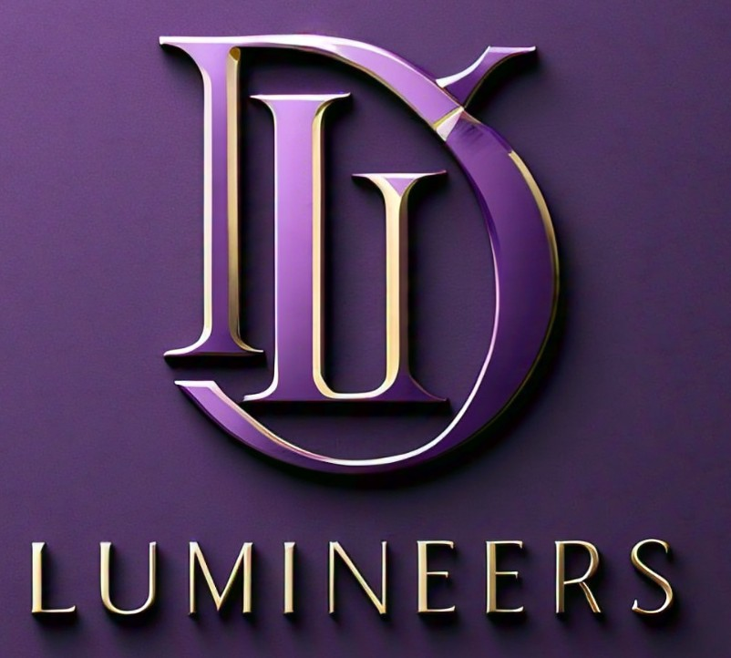

# 🌟 LUMINEERS - Travel & Adventure Blog

A modern, interactive travel and adventure blog built with Next.js, featuring stunning animations, custom cursor effects, and a beautiful gradient design. Explore the world through captivating stories and immersive user experiences.



## ✨ Features

- **🎨 Modern UI Design**: Beautiful gradient backgrounds with blue-to-black transitions
- **🖱️ Custom Animated Cursor**: Interactive cursor that expands on hover with glowing effects
- **📱 Responsive Design**: Fully responsive layout that works on all devices
- **⚡ Next.js 15**: Built with the latest Next.js for optimal performance
- **🎭 Smooth Animations**: CSS transitions and hover effects for enhanced user experience
- **🖼️ Image Optimization**: Optimized images using Next.js Image component
- **🎯 Progressive Web App Ready**: Configured with next-pwa for PWA capabilities
- **💨 Tailwind CSS**: Utility-first CSS framework for rapid styling

## 🚀 Quick Start

### Prerequisites

- Node.js 18+ 
- npm or yarn package manager

### Installation

1. **Clone the repository**
   ```bash
   git clone <repository-url>
   cd LUMINEERS-WEB
   ```

2. **Install dependencies**
   ```bash
   npm install
   # or
   yarn install
   ```

3. **Run the development server**
   ```bash
   npm run dev
   # or
   yarn dev
   ```

4. **Open your browser**
   Navigate to [http://localhost:3000](http://localhost:3000) to see the application.

## 📁 Project Structure

```
LUMINEERS-WEB/
├── app/                    # Next.js 13+ App Router
│   ├── fonts/             # Custom fonts (Geist)
│   ├── favicon.ico        # Site favicon
│   ├── globals.css        # Global styles and animations
│   ├── layout.js          # Root layout component
│   └── page.js            # Home page component
├── public/                # Static assets
│   ├── lumineers.jpeg     # Project banner image
│   └── *.svg              # Icon assets
├── jsconfig.json          # JavaScript configuration
├── next.config.mjs        # Next.js configuration
├── package.json           # Dependencies and scripts
├── postcss.config.mjs     # PostCSS configuration
├── tailwind.config.js     # Tailwind CSS configuration
└── README.md              # Project documentation
```

## 🛠️ Technologies Used

### Core Framework
-  **Next.js 15.0.2** - React framework for production
-  **React 19.0.0-rc** - JavaScript library for building user interfaces

### Styling & Design
-  **Tailwind CSS 3.4.1** - Utility-first CSS framework
-  **PostCSS** - CSS post-processor
-  **Custom CSS Animations** - Hand-crafted cursor and hover effects

### Development Tools
-  **ESLint** - Code linting and formatting
-  **next-pwa 5.6.0** - Progressive Web App capabilities

## 🎨 Design Features

### Color Palette
- **Primary Gradient**: Blue-900 → Indigo-800 → Black
- **Accent Colors**: Red-400, Purple-500, Blue-600
- **Interactive Elements**: Blue-500 with hover states

### Typography
- **Headings**: Extrabold with gradient text effects
- **Body Text**: Clean, readable fonts with proper spacing
- **Interactive Text**: Smooth scaling and color transitions

### Animations
- **Custom Cursor**: Expandable with glow effects
- **Hover Effects**: Scale transformations and opacity changes
- **Gradient Text**: Animated color transitions
- **Smooth Transitions**: 300ms duration for all interactions

## 📝 Available Scripts

```bash
# Development
npm run dev          # Start development server

# Production
npm run build        # Build for production
npm run start        # Start production server

# Code Quality
npm run lint         # Run ESLint
```

### Script Explanations:
- `npm run dev`: Runs the Next.js development server for local development
- `npm run build`: Builds the project for production (optimized for performance)
- `npm run start`: Starts the application in production mode after building
- `npm run lint`: Runs ESLint to check for code quality issues

## 🔧 Configuration

### Next.js Configuration
The project includes optimized settings for:
- External image domains (wallpaperflare.com)
- Image optimization
- Performance enhancements

### Tailwind Configuration
Custom configurations include:
- Extended color palette
- Responsive breakpoints
- Custom component paths

## 🌐 PWA Features

The application is configured as a Progressive Web App with:
- Service worker registration
- Offline capabilities
- App-like experience on mobile devices

## 🎯 Sections Overview

### Hero Section
- Full-screen background image
- Animated title "Journey Beyond Limits"
- Call-to-action button with hover effects
- Responsive typography

### Adventure Highlights
- Grid layout showcasing travel stories
- Hover overlays with "Read More" prompts
- Responsive design (1 column mobile, 3 columns desktop)

### Interactive Elements
- Custom animated cursor throughout the site
- Hover effects on all interactive elements
- Smooth transitions and animations

## 📱 Responsive Design

The application is fully responsive with breakpoints:
- **Mobile**: < 768px (1 column layout)
- **Tablet**: 768px - 1024px (2 column layout)
- **Desktop**: > 1024px (3 column layout)

## 🚀 Deployment

### Build for Production
```bash
npm run build
```

### Deploy to Vercel (Recommended)
1. Push code to GitHub
2. Connect repository to Vercel
3. Deploy automatically

### Deploy to Other Platforms
The application can be deployed to any platform that supports Node.js:
- Netlify
- Heroku
- AWS
- Digital Ocean

## 👨‍💻 Maintainers

This project is maintained by the following developers:

| Maintainer | GitHub Profile |
|------------|----------------|
|  <br> **Anish Seth** | [github.com/Anish-2005](https://github.com/Anish-2005) |
|  <br> **Tiyasa Mukherjee** | [github.com/Tiyasa-Mukherjee](https://github.com/Tiyasa-Mukherjee) |

## 🤝 Contributing

1. Fork the repository
2. Create a feature branch (`git checkout -b feature/AmazingFeature`)
3. Commit your changes (`git commit -m 'Add some AmazingFeature'`)
4. Push to the branch (`git push origin feature/AmazingFeature`)
5. Open a Pull Request

## 📄 License

This project is open source and available under the [MIT License](LICENSE).

## 🆘 Support

If you encounter any issues or have questions:
1. Check the [Issues](../../issues) section
2. Create a new issue with detailed description
3. Contact the development team

## 🎉 Acknowledgments

- **Next.js Team** - For the amazing React framework
- **Tailwind CSS** - For the utility-first CSS framework
- **Vercel** - For excellent deployment platform
- **Wallpaperflare** - For the beautiful background images

---

**Built with ❤️ by the Lumineers Team**

*Explore the world, one story at a time.*
